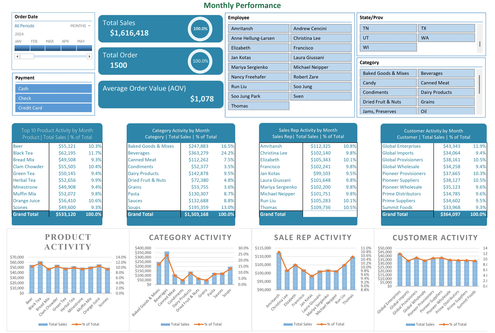

  <h1>Monthly Sales Performance Dashboard</h1>
  
<i>An Interactive Excel Dashboard for Strategic Business Insights</i>

  
  

  
  

 

  

 

<table align="center">
  <tr>
    <td width="33%" valign="top">
      <h3>🎯 The Key Business Question</h3>
      
How can we reduce the <strong>~10 hours</strong> our sales managers spend weekly compiling manual reports and instead empower them to make faster, data-driven decisions to boost regional performance?

    </td>
    <td width="33%" valign="top">
      <h3>💡 The Solution</h3>
      
An interactive dashboard that consolidates complex sales data into a single, intuitive interface. It automates reporting and provides real-time insights, directly addressing the business need.

    </td>
    <td width="33%" valign="top">
      <h3>📈 The Impact</h3>
      
Empowers managers to identify trends and opportunities instantly. This is projected to <strong>save each manager 5+ hours per week</strong> and enables targeted strategies for a potential <strong>5-10% revenue uplift</strong> in underperforming regions.

    </td>
  </tr>
</table>

---

<h2>📄 The Data Story: From Numbers to Narrative</h2>

  
A dashboard is most powerful when it tells a story. This tool is designed to guide users through a narrative of discovery, helping them uncover the "why" behind the numbers.

<h4>Key Storylines Revealed by the Dashboard:</h4>
<ul>
  <li><strong>Performance Pulse-Check:</strong> The main KPIs—Total Sales, Total Orders, and Average Order Value (AOV)—act as the headline of our story, offering an immediate snapshot of the company's health.</li>
  <li><strong>Identifying Sales Champions:</strong> By filtering by Employee, managers can instantly identify top performers. This turns performance data into a replicable training tool.</li>
  <li><strong>Uncovering Regional & Product Hotspots:</strong> By combining State and Category filters, we pinpoint geographic trends and product-market fit, which is crucial for optimizing inventory and marketing spend.</li>
</ul>

<h4>⭐ Actionable Insight Example: Unlocking a Sales Strategy</h4>
<blockquote>
  
<strong>Observation:</strong> The dashboard revealed that our top sales rep, James Howard, consistently outperforms others by bundling 'Fresh Blend Coffee' with a 'Biscotti' add-on, a pattern not visible in any other rep's sales.

  
<strong>Actionable Strategy:</strong> This insight provides a ready-made sales playbook. We can now train the entire sales team on this "coffee and biscotti" bundling strategy to increase the Average Order Value (AOV) across the team.

</blockquote>

<h2>⚙️ Features & Functionality</h2>

  
This dashboard is built for intuitive interaction, allowing any user, regardless of technical skill, to explore the data freely.

<ul>
  <li><strong>Fully Interactive Slicers:</strong> Dynamically filter the entire dashboard by <code>Order Date</code>, <code>Payment Method</code>, <code>Employee</code>, <code>State/Prov</code>, and <code>Category</code>.</li>
  <li><strong>Dynamic KPI Visuals:</strong> Key metrics and charts update in real-time to reflect filtered data.</li>
  <li><strong>Granular Analysis Tables:</strong> Four key tables provide deeper insights into Top Products, Category Performance, Sales Rep Leaderboard, and Top Customer Activity.</li>
  <li><strong>Cohesive & Professional Design:</strong> A clean layout ensures that the focus remains on the insights, not on deciphering the charts.</li>
</ul>

<h2>🛠️ Technical Skills Showcase</h2>

  
This project demonstrates proficiency in a range of data analysis and visualization techniques within Microsoft Excel.

  
  
  
  
  
  

<h2>🚀 Future Enhancements</h2>

To further increase the strategic value of this dashboard, the following next steps could be implemented:

<ul>
  <li><strong>Automate Data Refresh:</strong> Integrate with a live database using Power Query to enable a fully automated data refresh.</li>
  <li><strong>Incorporate Forecasting:</strong> Add a time-series forecasting module to predict sales for the upcoming quarter.</li>
  <li><strong>Customer Segmentation (RFM Analysis):</strong> Implement an RFM (Recency, Frequency, Monetary) model to segment customers for targeted marketing campaigns.</li>
</ul>

---

  <h3>Let's Connect!</h3>
  
I am passionate about turning data into strategic assets and am actively seeking a remote Data Analyst role. If you're looking for someone who cares about the "why" behind the data, let's talk.

  
  

